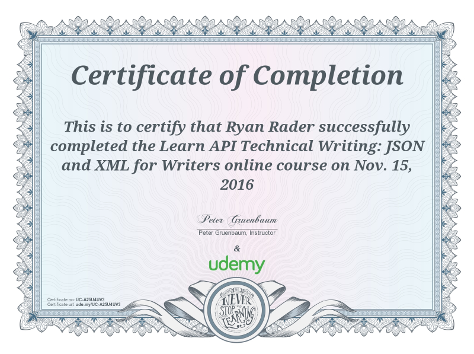
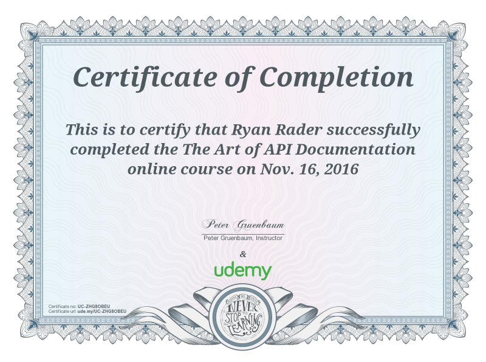

Welcome! This is a portfolio created by Ryan Rader

Please browse around to see examples of things I've done.

## Jekyll example

The site you're viewing right now is an example of what I can build with jekyll. I built the site in a github repo and hosted it on github pages. 

## OpenAPI example

I have created a lot of documentation for developers over the years. I have also taken several courses about how to create API docs.

To demonstrate, I created an API documentation site on github that uses data from an open source weather API. I built the site with the highly respected and most commonly used specification: OpenAPI (formerly known as Swagger). I'm very experienced with CSS, so I can style sites like this to fit any branding and format that a company needs. You can see this site <a href="https://lookatthem-tech.github.io/open-api-example/" target="_blank">here</a>.

## Github site example

To further demonstrate my capabilities to work with modern developer doc tools, I built, edited, versioned, and deployed a portfolio site in github. You can see it <a href="https://lookatthem-tech.github.io/portfolio005/Content/Topics/HomePgG.htm" target="_blank">here</a>

## Sphinx site example

I have a similar portfolio site that I built with sphinx to demonstrate what I can do with that tool.



## API course certificates

Also, here are certificates for a few of the API courses that I've completed.

## About me
I'm a writer with many years of experience in creating content of all kinds. I've written technical and non-technical content, marketing and promotional content, software and hardware content, print and online content, and more. Check out my LinkedIn profile to see full details about what I've done and where I've done it.



## LinkedIn profile

<a href="https://www.linkedin.com/in/ryan-rader-43042910/" target="_blank">See my profile on LinkedIn.</a>

