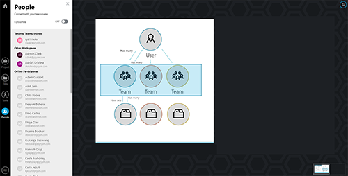
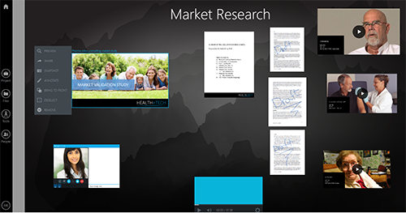

That's a lot to promise you &mdash; that you can collaborate with anyone... anywhere... any time. But Prysm makes that promise and fulfills it for you! Here's how:

<h2>Collaborate with anyone</h2>

Collaborate with:

<ul>
<li>Remote employees at your own company</li>
<li>Contractors who don't have the same access to your company's assets</li>
<li>People from other companies</li>
<li>Literally anyone capable of receiving an email and clicking a link!</li>
</ul>

Just go to Prysm for web (<a href="http://app.prysm.com/">app.prysm.com</a>) and create a free account. <a href="../Project/Projects.htm#CreatingProjects">Create a project</a>. (<strong>Projects</strong> are anything you want to organize, such as planning an event, or brainstorming about a new product.)

Then, on Prysm's People panel, invite the people you want to join you for collaboration. Prysm sends them an email with a link that takes them directly into your Prysm <a href="../Project/Workspaces.html">workspace</a>, where you add <a href="../Tools/Sketchboards.html#OpeningSketchboards">sketches</a>, images, documents, <a href="../Files/WorkingWithProjectFiles.htm#AddingProjectFiles">files</a>, and other rich content. (<strong>Workspaces</strong> are places where you can store and visually organize your content.)

<h2>Collaborate anywhere</h2>

Prysm has apps for all your devices, so that you can work wherever you are &mdash; and you can collaborate with anyone who is working wherever THEY&nbsp;are. Try all the Prysm apps:

<ul>
<li><strong>Prysm for web:</strong> Work from your web browser, as you do with all your web apps. Get the app at <a href="http://app.prysm.com/">app.prysm.com</a>.</li>
<li><strong>Prysm for desktop:</strong> Work from a Prysm app that seamlessly integrates with your Windows computer, enabling you to instantly share single applications or your entire desktop with others in your Prysm workspace. Get the app at <a href="../GettingStarted/GettingPFD.html#InstalliingPFD">the Microsoft Store on your Windows 10 device</a>.</li>
<li><strong>Prysm for iPhone:</strong>&nbsp;For the ultimate convenience, from your iPhone, you can <a href="../Files/AddingContentUsingIPhone.htm">add content</a>, <a href="../People/AddingPeopleIphone.html">add people</a>, and <a href="../GettingStarted/UnlockingDisplayUsingIPhone.htm">sign in to Prysm displays</a>. Get the app at <a href="../GettingStarted/GettingPFI.html#InstallingIPhone">the Apple App Store</a>.</li>
<li><strong>Prysm for rooms:</strong> Work on large portable or wall displays in conference rooms and collaboration spaces. Get the app by contacting <a href="https://www.prysm.com/support/">Prysm Support</a> or emailing <a href="mailto:support@prysm.com">support@prysm.com</a>.</li>
</ul>

All Prysm apps are touch-enabled (even on large video walls with Prysm for rooms) and as easy to use as your smart phone.

<h2>Collaborate any time</h2>

Unlike traditional, meeting-only apps, your Prysm projects are "always on"&nbsp;and available to you and your collaborators. Content that you add to your project remains exactly as you left it, so that anyone can pick up where anyone else stopped and make progress any time.

This helps you overcome time zone challenges &mdash; because when you collaborate with people across the globe, they are often not available to collaborate with you during your work day. With Prysm, your global colleagues can make progress toward your goals during their workday, and you can pick up where they left off during yours. It also smooths issues with your collaborators whose calendars are always fully booked. You can work in Prysm any time, and those busy folks can peek in on your progress in Prysm whenever they're able.

Prysm also is the perfect solution for large-scale meetings and presentations, where everyone is actually meeting and collaborating at the SAME&nbsp;time! Gather a bunch of people in a conference room where you present via Prysm for rooms, while those across the globe, who can't physically join you in the conference room, have an immersive, interactive meeting experience with you via Prysm's other apps.

